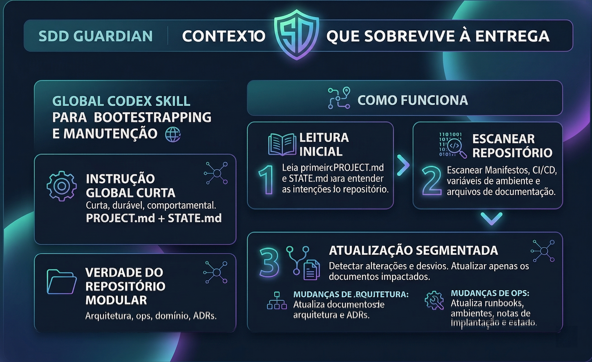
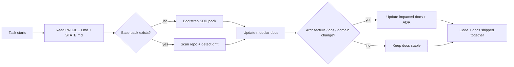
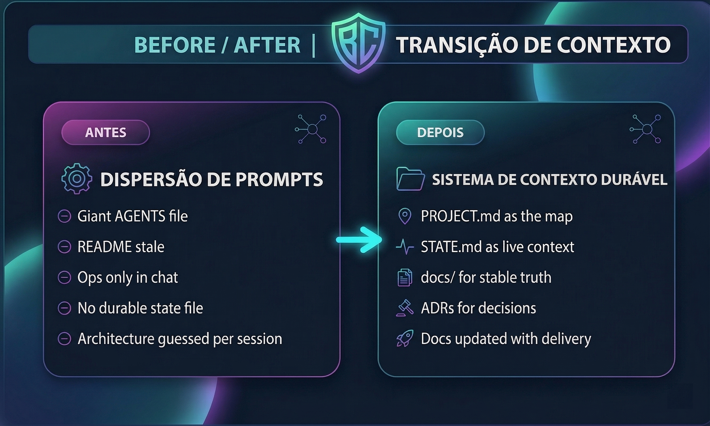
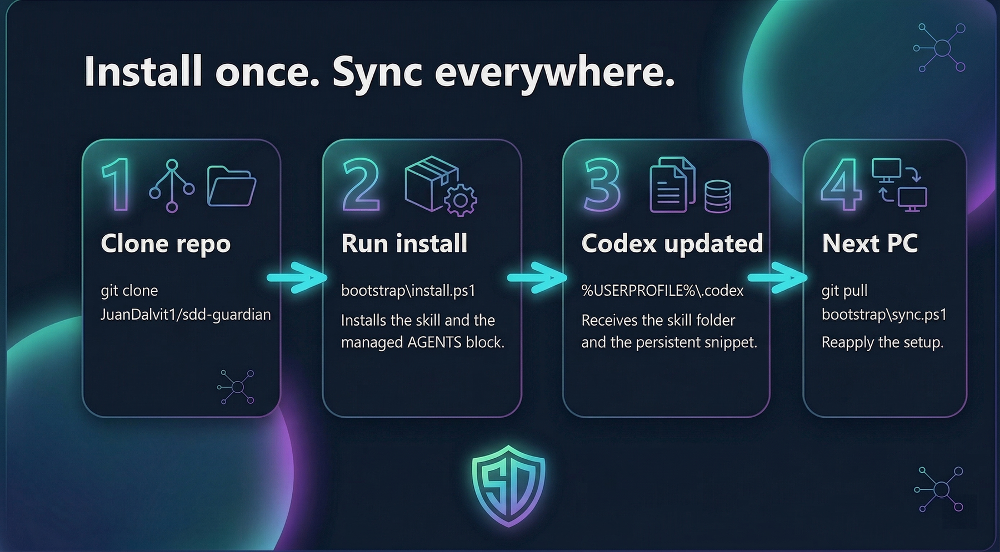

# SDD Guardian

<p align="center">
  
</p>

<p align="center">
  <a href="./docs/installation.md"></a>
  <a href="./docs/doc-pack.md"></a>
  <a href="https://github.com/JuanDalvit1/sdd-guardian/releases/latest"></a>
  <a href="https://github.com/JuanDalvit1/sdd-guardian/releases"></a>
  <a href="./LICENSE"></a>
</p>

> Global Codex skill that bootstraps and maintains agent-legible SDDs, `PROJECT.md`, `STATE.md`, ADRs, and ops docs so long-running projects do not lose context.

`sdd-guardian` turns documentation into a delivery gate instead of an afterthought. It gives Codex a stable, modular entrypoint to understand a project, preserve intent, and keep context alive across long sessions, new features, bugfixes, and new machines.

## Why this exists

Most repos decay in the same pattern:

- the README becomes onboarding-only and stops reflecting reality
- architecture knowledge stays trapped in chat history or in one engineer's head
- AI agents receive giant ad-hoc prompts because the repo itself does not expose clean context
- important decisions disappear because there is no durable `STATE.md`, no ADRs, and no ops record

`sdd-guardian` fixes that by creating and maintaining a lightweight documentation system designed for both humans and agents.

## What it does

- Bootstraps a project SDD pack when the repo has weak or missing structure
- Audits existing docs and updates only the modules that drifted
- Keeps `PROJECT.md` and `STATE.md` as the first-read entrypoints for Codex
- Maintains modular architecture, ops, domain, and ADR docs instead of a single giant markdown file
- Recommends a short persistent Codex instruction block so documentation stays part of the workflow

## Why this works better for AI

The goal is not "more markdown". The goal is **better context topology**.

- Small stable entrypoint: `PROJECT.md` and `STATE.md`
- Durable system record: `docs/architecture`, `docs/ops`, `docs/domain`, `docs/adr`
- Low-noise persistent instruction: short enough to stay relevant, strong enough to shape behavior
- Mechanical drift detection: architecture, CI/CD, env, deploy, and runbook changes map to specific docs

An oversized `AGENTS.md` becomes a second codebase. A short agent contract plus modular repo docs scales much better.

## Visual flow



## Before / After

<p align="center">
  
</p>

**Before**

- repo without a reliable map
- no current state file
- scattered operational knowledge
- architecture understood only through chat history

**After**

- `PROJECT.md` explains the system at a glance
- `STATE.md` captures what is live, risky, pending, and next
- `docs/` stores stable architecture and ops truth
- ADRs preserve decisions instead of losing them in commits and conversations

## Documentation pack

The default pack created and maintained by the skill is:

- `PROJECT.md`
- `STATE.md`
- `docs/architecture/overview.md`
- `docs/architecture/components.md`
- `docs/architecture/flows.md`
- `docs/ops/deploy.md`
- `docs/ops/environments.md`
- `docs/ops/runbook.md`
- `docs/domain/invariants.md`
- `docs/adr/*`
- `README.md` when onboarding or public usage changed

See [doc-pack.md](./docs/doc-pack.md) for the contract and update rules.

## Install globally in Codex

<p align="center">
  
</p>

Fastest path:

1. Download the latest ZIP from [releases/latest](https://github.com/JuanDalvit1/sdd-guardian/releases/latest)
2. Extract it anywhere
3. Run `bootstrap\install.ps1`

```powershell
git clone https://github.com/JuanDalvit1/sdd-guardian
cd sdd-guardian
powershell -ExecutionPolicy Bypass -File .\bootstrap\install.ps1
```

This installs the skill into `%USERPROFILE%\.codex\skills\sdd-guardian` and updates `%USERPROFILE%\.codex\AGENTS.md` with a managed persistent instruction block.

The release also ships a `sdd-guardian-skill-<version>.zip` asset for people who only want the skill payload.

Detailed guide: [installation.md](./docs/installation.md)

Release history: [CHANGELOG.md](./CHANGELOG.md)

## Recommended persistent instruction

The repo ships a short persistent snippet on purpose:

```text
Para toda task de software:
1. Leia PROJECT.md e STATE.md antes de propor mudancas, se existirem.
2. Se o pacote documental base nao existir, use a skill sdd-guardian para cria-lo.
3. Se a mudanca afetar arquitetura, fluxos, integracoes, deploy, ambientes, runbooks, estrutura do repo, onboarding ou decisoes tecnicas, atualize os documentos impactados no mesmo trabalho.
4. Prefira documentacao modular em docs/ e ADRs; nao concentre tudo em um markdown gigante.
5. Preserve conteudo manual util e ajuste apenas o que foi impactado.
6. Considere a task concluida somente quando codigo, testes e documentacao impactada estiverem consistentes.
```

Why this stays short and how to combine it with project docs: [persistent-instructions.md](./docs/persistent-instructions.md)

## Daily workflow

1. Start a task
2. Read `PROJECT.md` and `STATE.md`
3. Let Codex or `sdd-guardian` scan the repo
4. Implement the change
5. Update only the impacted docs
6. Ship code and docs together

If you work across multiple PCs, use this repository as the source of truth and rerun `bootstrap\sync.ps1` after pulling.

## Limitations

- The skill does not replace engineering judgment
- It does not try to infer hidden product strategy from thin code clues
- It should not rewrite the entire documentation set on every small bugfix
- It assumes the repo is the long-term home of project truth, not just chat transcripts

## Non-goals

- giant, all-knowing prompt files
- auto-generating architecture fiction disconnected from code
- treating docs as marketing copy only
- maintaining context only inside one AI tool session

## Contributing and roadmap

- Read [CONTRIBUTING.md](./CONTRIBUTING.md) before changing templates, scripts, or installation logic
- Report gaps with the provided issue templates
- Future roadmap includes richer drift heuristics, optional CI helpers, and project-level adoption kits

## References

- [Installation guide](./docs/installation.md)
- [Changelog](./CHANGELOG.md)
- [Persistent instructions](./docs/persistent-instructions.md)
- [Adoption playbook](./docs/adoption-playbook.md)
- [Why agent-legible docs matter](./docs/why-agent-legible-docs.md)
